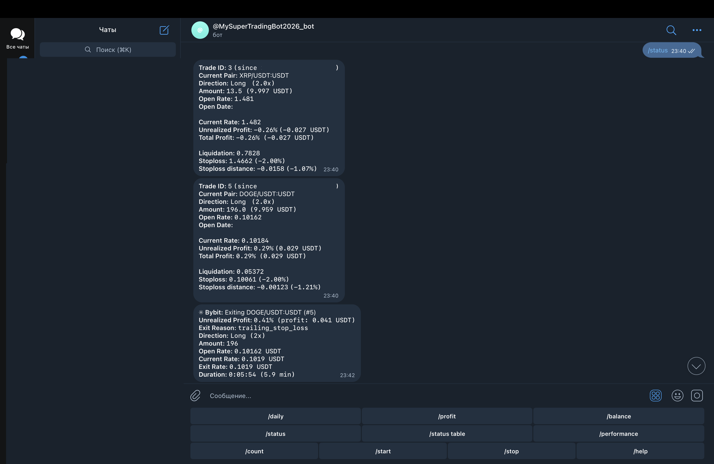
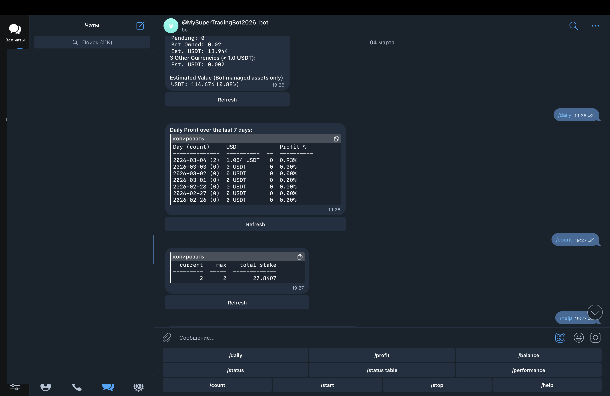

# Торговый бот для Freqtrade (Spot DCA Strategy v2)

## 📌 О проекте
Этот бот разработан для автоматической торговли на криптовалютных биржах через платформу Freqtrade. Стратегия использует технические индикаторы и механизм усреднения позиции (DCA) для снижения рисков.

### 1. Логика торговли и управление рисками

*Бот одновременно управляет несколькими позициями, использует стоп-лосс (2%) и трейлинг-стоп для автоматического выхода из сделок. На скриншоте видно открытые позиции по XRP и DOGE, а также закрытие DOGE по трейлинг-стопу с прибылью 0.41% за 5.9 минут.*

### 2. Результативность и статистика

*Общий баланс под управлением бота — 114.68 USDT (+0.88%), дневная прибыль 1.054 USDT (0.93%) за 2 сделки.*

## ⚙️ Основные возможности
- **Таймфрейм**: 5 минут
- **Торговля**: только в лонг (покупка)
- **Индикаторы**: EMA, RSI, ADX, ATR, Stochastic
- **Условия входа**: пересечение EMA (быстрая выше медленной) + RSI 45-72
- **Риск-менеджмент**: стоп-лосс 25%, трейлинг-стоп, частичное закрытие позиций
- **DCA (дозакупка)**: до 3 дополнительных входов при падении цены (-4.5%, -9%, -16%)
- **Тейк-профиты**: 2.2% → 4.5% → 8% (частичная фиксация прибыли)

## 🧪 Что тестировалось
- Проверка корректности работы индикаторов (через логи)
- Тестирование логики DCA на исторических данных
- Обработка ошибок при сохранении состояния бота
- Проверка условий входа/выхода на разных парах

## 🛠 Инструменты, которые использовались
- Python (анализ кода, написание тестов)
- Postman (тестирование API бирж)
- Freqtrade (бэктестинг)
- Git/GitHub (контроль версий)

## 📁 Структура
- `StrategySpotDCA_V2.py` — основной файл стратегии
- `config.json` — конфигурация для запуска
- `user_data/` — папка с данными и логами

## 🚀 Как запустить (для проверки)
1. Установить Freqtrade
2. Скопировать стратегию в папку `user_data/strategies`
3. Запустить бэктест: `freqtrade backtesting --strategy StrategySpotDCA_V2`

## 🛠 Тестирование и QA
В проекте реализован системный подход к тестированию:
*   [Чек-лист проверок](./tests/CHECKLIST.md)
*   [SQL-запросы для верификации данных](./tests/SQL_QUERIES.md)

## 📝 Что улучшено в версии 2.1
- Добавлено сохранение состояния (чтобы не пропускать сигналы после перезапуска)
- Очистка старых данных (экономия памяти)
- Улучшена логика частичного закрытия позиций
